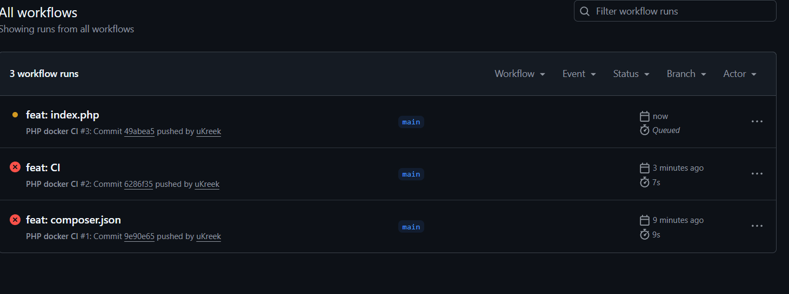

# Лабораторная работа №9: CI/CD для PHP-приложения с использованием GitHub Actions и Docker
настраивать CI/CD pipeline
использовать GitHub Actions
запускать Docker-контейнеры в CI
автоматически запускать тесты PHPUnit
выявлять ошибки через CI

## 💃 Автор
Меркулова Елизавета, ПМ-2

## 🌼 Вариант
10 

## 🍽️ Содержимое проекта

```.github/workflows/ci.yml``` — CI pipeline

```code/index.php``` — основная страница

```tests``` — тесты

```docker-compose.yml``` — описание Nginx

```screenshots/``` — скриншоты

## 📸 Скриншоты


## 🎉 Результат
При пуше запускаются автоматические тесты
